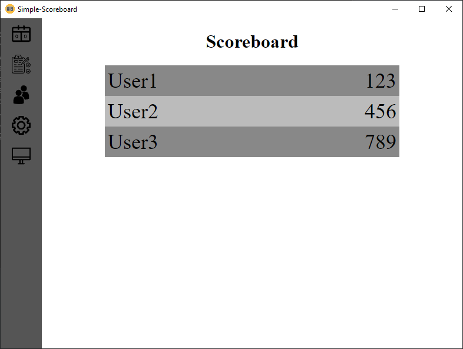

# Simple-Scoreboard

Scoreboard is just a very simple scoreboard system, mainly developed to use in OBS, but should be able to be used everywhere.

It uses an electron app as the control panel and admin page. It also includes a webserver to import the scoreboard on another system, and access the control panel remotely.



## Running the app

To install the dependencies run
```
npm i
```
To start the app as is run
```
npm start
```

## Building the app

To build the app run
```
npm run build
```

To create an installer run
```
npm run setup
```